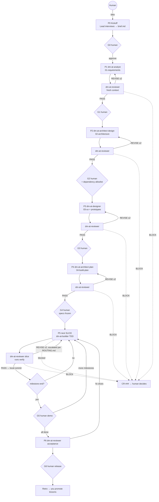

# Agent Team — Builder's Guide

This guide is for the human. Agents never load it. The runtime is [SKILL.md](./SKILL.md) (the Lead), [PROTOCOL.md](./PROTOCOL.md), [ROUTING.md](./ROUTING.md) (read by the Lead only), and the five `agents/dm-at-*/SKILL.md` files.

> **New here?** Start with [README.md](./README.md) — the step-by-step usage guide for directed and YOLO runs. This document is the deeper reference: rationale, host setup, rollout plan, and troubleshooting.

---

## 1. Executive summary

**Goal:** turn a product idea into a working, tested, well-designed greenfield application with a small AI team, while you make only the decisions that matter.

**The team:** a Lead (the `dm-agent-team` skill) plus five agents: analyst, architect, designer, builder, and reviewer. They hand work to each other through files in `.agent-team/`. Nothing goes downstream without an independent review, and nothing gets frozen without your approval.

**What makes it reliable rather than hype:**

- **One owner per file.** Agents cannot overwrite each other.
- **Trace IDs everywhere** (`REQ → ADR/API → SCR → SLICE → test`). An invented feature has no ID, so the reviewer can see it.
- **Independent review in a fresh context.** The author never grades its own work.
- **A clean room.** Code comes only from approved specs and local files. Dependencies come only from an allowlist you approved.
- **Seven human gates** (G0–G6), plus a stop on anything irreversible. The **run mode** decides which gates stop for you (see §1a).
- **Hard retry limits** (2 revise rounds, 3 test attempts, and a breaker after 3 escalations in a row). Failures stop and ask; they don't spiral.
- **Cheap by design.** Every agent is a fresh subagent; the Lead reads Returns, not artifacts; questions come in batches with recommended answers; command output goes to log files; independent slices build in parallel.

**Assumptions (change them in the files if they're wrong):**

- You run it in an agent host that can start subagents, such as OpenCode or Claude Code. Without subagents it still works inline, but review becomes self-review and you must review manually.
- Each run covers one greenfield project in one folder, with local git and no remote integration.
- "Clean room" means implementation derives only from specs. Reference material is allowed, but only the analyst may read it.
- The stack is not fixed. The architect proposes it, honouring any constraints and standards you give in the brief.

## 1a. Run modes and continuation

You pick the mode at G0, and you can switch at any stop.

| Mode | You are asked | Use it when |
|---|---|---|
| **stepwise** (default) | every question batch and every gate G0–G6 | first runs, or a project you care about getting exactly right |
| **checkpoint** | question batches; G0; G1–G4 together as one spec review; G6 | you want to own the specs but not babysit the build |
| **yolo** | G0 and G6 only. Recommended answers are accepted for you and shown at the end | toys, spikes, and prototypes |

Every mode still stops for new dependencies, anything outside the folder, deletions, push or deploy, secrets, scope-changing change requests, and the circuit breaker.

**Keeping it running.** Inside one session the Lead never pauses to ask "shall I continue?"; it runs to the next stop. But one session cannot run forever: context grows, cost per turn grows with it, and hosts cap steps (`opencode.jsonc` sets `build` to 50). So the Lead takes a **session break** after each phase or milestone, or about 25 dispatches, and [scripts/run.sh](./scripts/run.sh) starts the next fresh session from `state.md`:

```bash
# after G0 is approved in an interactive session
~/.agents/skills/dm-agent-team/scripts/run.sh --host opencode
~/.agents/skills/dm-agent-team/scripts/run.sh --host claude -- --permission-mode acceptEdits
```

The driver stops when the run is done, when a human stop is reached (answer it with `/dm-agent-team`, then rerun the driver), or after two sessions without progress.

**Permissions for unattended runs.** A headless session can't answer permission prompts, so anything not pre-approved fails. The team edits files, runs `git` (worktree, merge, commit, branch), runs the verify command, and installs allowlisted packages. `acceptEdits` covers only file edits, so also pre-approve those commands in the project's host config, rather than using a blanket bypass flag:

- **Claude Code:** in `.claude/settings.json`, add `permissions.allow` entries such as `"Bash(git:*)"`, `"Bash(<package manager>:*)"`, and one entry for the verify command from `02-architecture.md` §10. Check the rule syntax against the current Claude Code docs.
- **OpenCode:** set `permission.bash` in `opencode.jsonc` to allow the same commands (this repo's own `opencode.jsonc` allows all bash and asks only for `rm -rf` and `git push`).

Do this after G2, once the stack and verify command are known; before that, the team only writes files.

**Parallel building.** The architect plans slices with exact `touches:` and lists shared "hotspot" files, and the walking skeleton creates those hotspots up front. The Lead then builds up to `max-parallel` independent slices at once, each in its own git worktree, reviews them in parallel, and merges each one only if verify is green on the merged tree. A conflict sends the slice back for a rebuild on the new base.

---

## 2. Recommended agent team

| Agent | Why it exists | Without it… |
|---|---|---|
| **Lead** (`dm-agent-team`) | Routes work, keeps state, holds gates. Authors nothing. | Agents drift, handoffs get lost, and sessions can't resume. |
| **dm-at-analyst** | Separates *what* from *how*. Turns intent into testable acceptance criteria. | The builder guesses requirements. This is the largest source of rework. |
| **dm-at-architect** | Makes the stack, boundary, contract, and build-plan decisions once, explicitly, as ADRs. | Every slice re-decides the architecture and the code becomes inconsistent. |
| **dm-at-designer** | Makes sure every screen has every state and a coherent visual system. | You get functional but ugly UI with missing error and empty states. |
| **dm-at-builder** | Writes test-first code, one vertical slice at a time. | — |
| **dm-at-reviewer** | Provides an independent quality gate with evidence. | Self-grading. Agents confidently pass their own mistakes. |

**Why not fewer?** Merging analyst and architect is the most tempting cut. It saves one phase but lets solution bias into requirements; use it only for prototypes. The designer can be skipped at G2 for headless products.

**Why not more?** A separate planner, tester, or documenter would duplicate the architect's plan mode, the builder's TDD, and the reviewer's acceptance checks. Add a role only when the metrics show a repeated failure that no existing role can fix.

---

## 3. Agent-by-agent blueprints

The full prompts are the `SKILL.md` files. This table is the summary.

| | Analyst | Architect | Designer | Builder | Reviewer |
|---|---|---|---|---|---|
| **Inputs** | brief, decisions, reference material (dirty room) | brief, 01, repo standards; plus 03 in plan mode | brief, 01, 02 | one slice, the spec sections it traces to, existing code | target, upstream specs, verify command |
| **Outputs** | `01-requirements.md` | `02-architecture.md`, `04-build-plan.md` | `03-ux.md`, HTML prototypes | code, tests, slice report | review file with a verdict |
| **Tools** | read/write files, question batches via the Lead | read/write files, question batches via the Lead | read/write files, local browser preview | file edits, shell (build/test), package manager limited to the allowlist | shell (verify, git diff), file reads |
| **Success** | every *Must* criterion is testable; zero blocking questions | 100% REQ/NFR coverage; runnable verify; minimal allowlist | every SCR has all states; tokens only; AA contrast | verify green; one test per criterion; no deviations | escaped defects in acceptance trend to 0 |
| **Main failure mode** | invents features or writes vague criteria | over-engineering | scope creep through design | faking green or scope creep | rubber-stamping |
| **Guardrail** | must trace to brief or a decision; banned-word list | everything traces to an NFR or ADR; modular monolith by default | new scope becomes a question; data needs become a CR | 3-attempt stop; no test edits; clean room | must run verify itself; evidence required; re-checks every prior finding and everything that can regress |
| **Route** (tier · effort) | deep · medium | deep · high | deep · medium (standard · low for design-language questions) | standard · medium; deep for the walking skeleton, `deep` slices, and round 2 | light · low precheck, then deep · medium review; deep · high for spec review and acceptance |

**Example use cases:** an internal admin dashboard over a local database, a CLI tool with a config file, a small SaaS MVP, a desktop notes app, or a clean-room rewrite of a legacy tool (the legacy code goes in the dirty room; only the analyst reads it).

---

## 4. Workflow diagram



**Where things live**

- **Context:** each handoff lists the exact inputs. Agents read nothing else, which keeps context small and stops drift.
- **Short-term memory:** `state.md`, rewritten after every step.
- **Long-term memory:** the frozen specs and the append-only `decisions.md`. There is no hidden memory. If it isn't in a file, the team doesn't know it.
- **Approvals:** the gate rows in `state.md`, backed by `D-###` entries.
- **Audit:** `handoffs/` (each request and Return), `reviews/`, `log.md`, and git history (one commit per slice).

---

## 5. Prompt templates

All the prompts are ready to copy and paste, and they are already packaged as skills:

| Invoke | Prompt file | Use it directly when… |
|---|---|---|
| `/dm-agent-team` | [SKILL.md](./SKILL.md) | you want the full run, or to resume one |
| `/dm-at-analyst` | [agents/dm-at-analyst/SKILL.md](./agents/dm-at-analyst/SKILL.md) | you only want sharp requirements for an idea |
| `/dm-at-architect` | [agents/dm-at-architect/SKILL.md](./agents/dm-at-architect/SKILL.md) | you have requirements and want a design or build plan |
| `/dm-at-designer` | [agents/dm-at-designer/SKILL.md](./agents/dm-at-designer/SKILL.md) | you want a UX spec and prototype for an existing requirements doc |
| `/dm-at-builder` | [agents/dm-at-builder/SKILL.md](./agents/dm-at-builder/SKILL.md) | you want one planned slice implemented |
| `/dm-at-reviewer` | [agents/dm-at-reviewer/SKILL.md](./agents/dm-at-reviewer/SKILL.md) | you want an independent audit of any spec or code |

**Customise** by editing, in this order of leverage: the `Done when` criteria, then the guardrails, then the skeletons. Keep each change small and record it in the retro.

**Example kickoff:**

> /dm-agent-team Build a local-first desktop app for tracking my consulting hours per client and exporting monthly invoices as PDF. Quality bar: internal tool. Constraint: .NET 10 + React. Reference: `./legacy/timesheet.xlsx`. Mode: checkpoint, max-parallel 3.

---

## 6. Tools and stack

| Need | Use | Notes |
|---|---|---|
| Agent host | OpenCode, Claude Code, or Copilot CLI (anything that reads `~/.agents/skills`, starts subagents, and ideally runs them in parallel) | Subagents give the reviewer a fresh context and keep the Lead's context small. |
| Continuation | [scripts/run.sh](./scripts/run.sh) | One fresh host session per phase or milestone, until a human stop. |
| Model routing | [ROUTING.md](./ROUTING.md) and `.agent-team/models.md` | Which tier and effort each kind of work gets, and when to escalate. Edit overrides in `models.md`. |
| Deep tier | the strongest reasoning model (for example Claude Opus 5.5) | approach evaluation, plans, specs, review verdicts, the walking skeleton, hard slices |
| Standard tier | a cheaper strong coding model | the Lead, routine slices, simple question batches |
| Light tier | a fast, cheap model (for example your `explore` agent's model) | the mechanical precheck; never verdicts |
| State | Markdown in `.agent-team/` and local git | readable, diffable, and survives across sessions |
| Verification | the project's own build, lint, and test toolchain, chosen in 02 | the single verify command is the source of truth |
| UI checks | a local browser preview; Playwright if it is on the allowlist | for prototypes and acceptance walkthroughs |
| No-code or APIs | none in v1, deliberately | local-only is the clean-room boundary |

### Setting up model routing on your host

The Lead uses the first mechanism your host supports and records it in `.agent-team/models.md`. Check the field names against your host's current docs.

- **Per-call model (`dispatch-param`).** VS Code Copilot's subagent tool takes a model per call, so nothing needs setting up; just fill the model names into `models.md`.
- **Named agents (`named-agents`).** Define one subagent per tier, then the Lead dispatches by name. In OpenCode (`opencode.jsonc`):

  ```jsonc
  "agent": {
    "dm-agent-team-deep":     { "mode": "subagent", "model": "<provider/strongest-model>", "description": "dm-agent-team deep tier" },
    "dm-agent-team-standard": { "mode": "subagent", "model": "<provider/coding-model>",    "description": "dm-agent-team standard tier" },
    "dm-agent-team-light":    { "mode": "subagent", "model": "<provider/fast-model>",      "description": "dm-agent-team light tier" }
  }
  ```

  In Claude Code, add `.claude/agents/dm-agent-team-deep.md` (and `-standard`, `-light`) with frontmatter `name`, `description`, and `model: opus` (`sonnet`, `haiku`), and the body "Follow the dispatch prompt exactly."
- **Effort.** If your provider exposes a reasoning-effort or thinking-budget option, add effort variants such as `dm-agent-team-deep-high` and set `effort-by: variant-agents`. Otherwise the Lead puts an `Effort:` line at the top of each dispatch prompt.
- **The Lead's model.** Start interactive sessions on a standard-tier model; the Lead mostly does bookkeeping. For unattended runs, use `scripts/run.sh --lead-model <model>`.

---

## 7. Seven-day implementation plan

| Day | Do | Done when |
|---|---|---|
| **1 — Install and dry run** | Run `./scripts/link-skills.sh`. Pick a **toy** project, such as a todo CLI. Run `/dm-agent-team` through G0 and G1. | `brief.md` and `01-requirements.md` exist, and you've seen one REVISE loop. |
| **2 — Design phases** | Continue the toy through G2–G4. Read every review file. Note where you corrected the team. | A frozen spec set, with your corrections listed. |
| **3 — Build** | Let it build the toy's walking skeleton and first milestone. Check that commits are per slice and verify really runs. | G5 · MS-1 approved, with a green verify you ran yourself. |
| **4 — Tune** | Make at most 3 prompt edits, aimed at the failures you saw. Typical ones: tighten a `Done when`, add a banned pattern, adjust slice size. Commit them as `dm-agent-team vN`. | Version bumped; the reason for each change is written down. |
| **5 — Real project, specs** | Start your real greenfield project. Spend real attention at G0–G2, because these gates have the most leverage. | G2 approved, with an allowlist you actually read. |
| **6 — Real project, UX and plan** | Run G3 and G4. Open the prototypes. Push back on the slice order if risk isn't first. | Specs frozen. |
| **7 — Real build and retro** | Run the build to MS-1 or further. Read the metrics. Promote 1–2 lessons into the prompts. | `retro.md` exists and you've decided what v2 changes. |

**Next steps (only when the metrics justify them):** add a cheap pre-review lint agent if the reviewer keeps finding trivia; raise `max-parallel` if stale rebuilds stay rare; move routine slice reviews to a cheaper tier only if escaped defects stay at zero.

---

## 8. Common mistakes to avoid

1. **Rubber-stamping gates.** G1 and G2 decide most of the outcome. A five-minute read there saves hours of rework later.
2. **Letting the reviewer share context with the author.** That is self-review with extra steps, and it will pass its own bugs.
3. **Slicing by layer** ("all the models, then all the APIs"). Nothing runs until the end. Keep slices vertical, with the walking skeleton first.
4. **Raising the retry limits when things fail.** Repeated failure usually means the spec is wrong. Fix the spec through a CR; more retries won't help.
5. **Adding agents to fix quality.** Tighten a `Done when` first. Add a role only for a failure that no existing role can own.
6. **Editing frozen specs by hand mid-build.** The state then lies. Go through a CR so the affected slices get marked stale.
7. **Trusting a green report without verify evidence.** The reviewer reruns verify for exactly this reason. Spot-check it yourself at milestones.
8. **Using a cheap model for review verdicts.** Use cheap models for building and mechanical checks, and the strong model for judging. Doing it the other way round is false economy.
9. **Running one giant session.** Cost per turn grows with context. Let the Lead take session breaks and let the driver resume.
10. **Choosing yolo for a real project on day one.** Yolo accepts every recommended answer. Use checkpoint until the first-pass PASS rate is high.

---

## 9. Final recommendations

**Where you stay in control:** every gate (G0–G6); every CR; every dependency; anything outside the folder; deleting anything you didn't ask for; push, publish, and deploy; secrets.

**How to measure success.** These come from `log.md` and are summarised in `retro.md`:

| Dimension | Metric | Healthy v1 target |
|---|---|---|
| Quality | escaped defects at acceptance; gates where you requested changes | ≤ 2 escaped defects; edits concentrated at G1 and G2 |
| Consistency | first-pass PASS rate for each agent | above 50%, and rising between runs |
| Speed | dispatches per slice; days from G0 to MS-1 | ≤ 3 dispatches per slice; MS-1 within 2 days |
| Cost | tokens per tier (from `log.md`); precheck FAILs that saved a deep review | builder mostly at standard tier; ladder escalations under 20% of slices |
| ROI | your estimate of hours for a solo build, minus the hours you spent at gates and on CRs | positive by the second project |

**Trade-offs you control:**

- **Speed:** checkpoint or yolo mode, higher `max-parallel`, the `prototype` quality bar (one review per milestone, one revise round), skipping P3. You trade control and quality.
- **Quality:** stepwise mode, a deep-tier builder, smaller slices, stricter `Done when`. You trade cost and time.
- **Cost:** a standard-tier Lead and builder, the light precheck, the driver's session breaks, and minimal handoff inputs. Tune routes in `models.md` from retro evidence. You trade first-pass rate.

**Versioning and change control.** The skill lives in git, and `state.md` records the skill version each run used. Change prompts only from retro evidence: one change, one reason, one commit. Compare first-pass rates across versions to see whether a change helped.

**Do today:** link the skills, open an empty folder, run `/dm-agent-team` on a toy idea, and stop after G1. Read `reviews/` and `log.md` to see how the handoffs and verdicts actually behave before you trust the team with real work.

---

## Migrating from the spec skills

`dm-agent-team` replaces `dm-spec-creation` and `dm-spec-execution`. Both still work for now; they will move to `skills/deprecated/` later, together, because `dm-spec-execution` reads files from `dm-spec-creation`.

**What carried over.** The parts of the spec skills that earned their keep now live in the team:

| From the spec skills | In `dm-agent-team` |
|---|---|
| Plan and sidecar SHA checks (`PLAN-DRIFT`) | §Spec integrity: approved artifacts are hashed and copied; an edit outside a CR is a stop |
| Failure classes and halts (`SPEC-DEFECT`, `STANDARDS-DEFECT`) | `blocked-by:` with four kinds (spec-gap, test-red, env, dependency), and `status: blocked` with a `halt:` line |
| Cross-spec consistency, fix at the lowest spec | CRs against approved specs; `reopened` and `recheck` gate rows; downstream re-checks from `impact:` |
| Gate checklists | Reviewer checklists with an evidence column; never re-run a red check unchanged; a logged human override |
| spec-03 implementation guidance and the spec-02x sidecars | `02-architecture.md` §7 cross-cutting conventions, §6 atomicity and concurrency, §10 test seams |
| spec-00 posture questions and the decision logs | Analyst probes; one `D-###` form with `affects:` the reviewer checks |
| `ADOPTION-PROTOCOL.md` | [references/ADOPTION.md](./references/ADOPTION.md) |

**What did not.** The fixed .NET/React stack (the architect now chooses a stack per project), the seven-spec chain, numeric gate rubrics, HTML anchors, the layer-by-layer phase plan, and PR-per-phase delivery with merge-on-green (the team never pushes; it commits locally, one slice at a time).

**If you have a project on the spec skills:**

| Where the project is | What to do |
|---|---|
| Specs not started | Use `/dm-agent-team`. |
| Specs in progress or gate-passed, no code yet | Start `/dm-agent-team` in the project and list the `01-specifications/` files as *Existing specs* at G0. [ADOPTION.md](./references/ADOPTION.md) maps each old spec to 01, 02, or 03. The team writes its own specs from them, and re-plans spec-06 as vertical slices. |
| `execution-state.md` exists and Phases are in progress | Finish with `dm-spec-execution`. Switching mid-build means re-planning the remaining work. If you do switch, adopt the specs as above and tell the architect at P4 which features are already built. |

**Things to watch:**

- **Standards files.** The old specs cite standards inside the `dm-spec-creation` skill folder. The team's clean room won't read another skill's folder, so copy the standards you want into the project and list them under the brief's *Constraints*.
- **Old pointers.** A committed `spec-06-execution-plan.md` and the spec skills' own handoff text tell the agent to run `dm-spec-execution`. Ignore that once you have switched.
- **Links after the move.** When the spec skills move to `skills/deprecated/`, run `scripts/unlink-skills.sh` and then `scripts/link-skills.sh`; otherwise their old links in `~/.agents/skills/` dangle.
