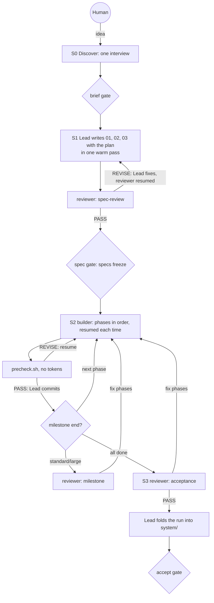

# Agent Team — Builder's Guide

For the human; agents never load it. Start with [README.md](./README.md) for how to run the team. This guide covers why it is shaped the way it is, how to set up your host, and how to migrate from the spec skills. The reasoning behind this version, with the expected effect of each change, is in [lean-2-design.md](./lean-2-design.md).

## 1. Design principles

1. **Context is cheapest where it is cached longest.** The main conversation keeps its cache across the human's pauses; a subagent is paid for from zero and discarded. So the Lead interviews, writes the specs, and integrates in its own context, and dispatches only a fresh-context reviewer and a persistent builder.
2. **Clarity up front, autonomy after.** One interview gathers everything the old analyst, designer, and architect used to ask separately. After the brief gate nobody asks the human; agents decide, record assumptions, and show them at the next gate.
3. **Spend judgment where mistakes are expensive and invisible.** The specs get the strongest model and an independent review; code gets a precheck script and verify, with deep review at milestones, for risky phases, and at acceptance. Separate fresh-context verifiers outperform self-critique, so the reviewer stays.
4. **Resume, don't restart.** A builder with a precheck failure, or a reviewer with fixes to re-check, is continued inside its cache window, not re-dispatched.
5. **Few, large phases; one builder.** A phase is the largest coherent piece one builder can finish in one session. Parallel lanes and worktrees exist only for large runs with independent phases.
6. **Goals and limits, not procedures.** Agent files say what good output looks like, what the agent owns, the hard constraints, and when it's done.
7. **Rare paths load on demand** (`references/`), and **a word budget** (`word-budget.txt`, enforced by lint) keeps the runtime files from growing back.

**Non-negotiable:** fresh-context independent review at the gates, verify as a hard gate, the human gates that stop in every mode (brief, accept), the clean room and allowlist, trace IDs from requirement to test, resumable state.

## 2. Flow



## 3. Host setup

**Models.** Run the interactive session on your strongest model: the Lead writes the specs. The driver's build sessions can use a cheaper Lead (`run.sh --lead-model`). Subagent routing is detected once and written to `.agent-team/models.md` ([ROUTING.md](./ROUTING.md)); in Claude Code the subagent tool takes `opus` or `sonnet` per call, so nothing needs setting up. In OpenCode, define named tier agents:

```jsonc
"agent": {
  "dm-agent-team-deep":     { "mode": "subagent", "model": "<provider/strongest-model>" },
  "dm-agent-team-standard": { "mode": "subagent", "model": "<provider/coding-model>" }
}
```

**Continuing an agent.** Claude Code can message a spawned agent to continue it; that is what makes resume-on-REVISE and the persistent builder cheap. On a host without it the Lead dispatches again, with the review as input, and the saving from recommendations 3 and 4 in the design note is smaller.

**Permissions.** Unattended sessions can't answer prompts. Pre-approve `git`, the package manager, and the verify command (`.claude/settings.json` `permissions.allow`, or OpenCode `permission.bash`). Keep the hard-stop guardrails the Lead offers at the brief gate ([references/host-guardrails.md](./references/host-guardrails.md)): they deny push, publish, deploy, and network commands without hooks. In OpenCode the last matching rule wins, so put your allows before them.

**Cost.** `scripts/run.sh --host claude` runs the host with JSON output and records `total_cost_usd`, turns, and duration per session in the run's `costs.tsv`. Interactive sessions: use the host's `/cost` before ending the session and note it in the retro.

## 4. Tuning from evidence

Every run's `retro.md` reports dispatches and resumes per stage, cost per session, REVISE rounds, escalations, and decisions you later overrode, and `lessons.md` carries forward what the team learned. Change one thing at a time:

- **Many REVISE rounds on the specs:** sharpen `references/SPECS.md`'s *what good looks like* for that spec, not the reviewer's checks.
- **Escaped defects at acceptance:** move that kind of project up a size, or mark more phases `risk: high`.
- **Builder assumptions you keep overriding:** add the missing question to the interview list in SKILL.md step 2.
- **Too many phases:** check the plan against the size's range; the reviewer flags a plan far above it.
- **A builder's verify over 3 minutes:** split it into `verify` and `verify-full` in 03 §10.

## Migrating from the spec skills

`dm-agent-team` replaces `dm-spec-creation` and `dm-spec-execution`. Both still work for now; they will move to `skills/deprecated/` together later, because `dm-spec-execution` reads files from `dm-spec-creation`.

| Where the project is | What to do |
|---|---|
| Specs not started | Use `/dm-agent-team`. |
| Specs written, no code yet | Start `/dm-agent-team` and list the `01-specifications/` files as *Existing specs* in the interview. [ADOPTION.md](./references/ADOPTION.md) maps each old spec to 01, 02, or 03, and the Lead re-plans the build in 03 §13. |
| `dm-spec-execution` phases in progress | Finish with `dm-spec-execution`. To switch anyway, adopt the specs and tell the Lead in the interview which features are already built. |

The old specs cite standards inside the `dm-spec-creation` folder, which the clean room won't read: copy the ones you want into the project and list them under the brief's *Constraints*. When the spec skills move, run `scripts/unlink-skills.sh` and then `scripts/link-skills.sh`.
