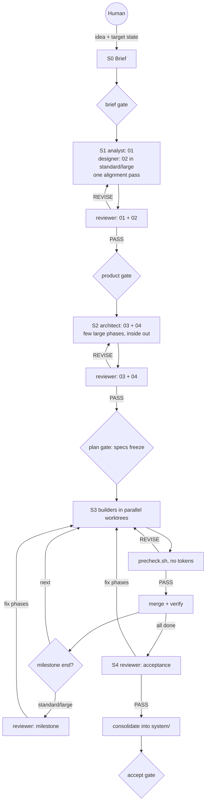

# Agent Team — Builder's Guide

For the human; agents never load it. Start with [README.md](./README.md) for how to run the team. This guide covers why it is shaped the way it is, how to set up your host, and how to migrate from the spec skills.

## 1. Design principles

The lean version came from one observation: the cost of a run was driven by process, not by the product. In the first end-to-end run, a few-hundred-line word-frequency CLI took 16 build units, 6 change requests, and 33 commits. Every per-phase precheck passed first time, so per-phase review found almost nothing, while the spec stages took several rounds.

1. **Spend judgment where mistakes are expensive and invisible.** Requirements, architecture, and the plan get the strongest model and an independent review. Code gets the verify command and a precheck script, which cost no tokens, and deep review only at milestones, for risky phases, and at acceptance.
2. **Scale the process to the project.** One size of process for a toy CLI and a production system makes the toy slow. Size (small, standard, large) changes how many specs, reviews, and phases a run has.
3. **Few, large phases.** Each phase carries a fixed cost: a handoff, a builder, the precheck, a worktree, a merge, verify, and bookkeeping. A phase is the largest coherent piece one builder can finish in one session. The inside-out order (foundation, core layers, UI last) still holds, but adjacent layers share a phase when they're small.
4. **Goals and limits, not procedures.** Agent files say what good output looks like, what they own, the hard constraints, and when they're done. How to get there is the model's job.
5. **Trust agents with small decisions.** A builder settles a gap that only affects its own phase and records it; you see every such decision at the next stop. Change requests are for scope, shared contracts, and dependencies.
6. **Review blocks only on defects.** A major finding is something that would ship a defect, break the build, or force someone downstream to guess. Missing ceremony and style are minors.
7. **Rare paths load on demand.** Multi-run bookkeeping, recovery, drift, and brownfield live in `references/`; the Lead reads them only when they apply.
8. **A word budget.** `word-budget.txt` caps every runtime file, and lint fails over budget. To add a rule, remove one, or raise the budget deliberately and say why.

**What stays non-negotiable:** fresh-context independent review at the gates, verify as a hard gate, the human gates that stop in every mode (brief, accept), one owner per file, the clean room and allowlist, trace IDs from requirement to test, and resumable state.

## 2. The team

| Agent | Owns | Main failure it prevents | Route (tier · effort) |
|---|---|---|---|
| Lead (`dm-agent-team`) | state, handoffs, decisions, commits | lost handoffs, runs that can't resume | standard · low |
| analyst | 01 requirements (and UX notes in small runs) | the builder guessing requirements | deep · medium |
| designer | 02 UX (standard and large) | missing error and empty states, incoherent UI | deep · medium |
| architect | 03 architecture, 04 build plan | every phase re-deciding the architecture | deep · high |
| builder | code, tests, phase reports | — | standard · medium (deep for `PHASE-001` and `risk: high`) |
| reviewer | reviews | self-grading | deep |

## 3. Flow



## 4. Host setup

**Model routing.** The Lead detects how your host chooses models and writes `.agent-team/models.md` ([ROUTING.md](./ROUTING.md)). Claude Code's subagent tool takes `opus`, `sonnet`, or `haiku` per call, so nothing needs setting up. In OpenCode, define named tier agents:

```jsonc
"agent": {
  "dm-agent-team-deep":     { "mode": "subagent", "model": "<provider/strongest-model>" },
  "dm-agent-team-standard": { "mode": "subagent", "model": "<provider/coding-model>" },
  "dm-agent-team-light":    { "mode": "subagent", "model": "<provider/fast-model>" }
}
```

Run the Lead itself on a standard-tier model (`run.sh --lead-model`).

**Permissions.** Unattended sessions can't answer prompts. Pre-approve `git`, the package manager, and the verify command (`.claude/settings.json` `permissions.allow`, or OpenCode `permission.bash`). Keep the hard-stop guardrails the Lead offers at the brief gate ([references/host-guardrails.md](./references/host-guardrails.md)): they deny push, publish, deploy, and network commands without hooks. In OpenCode the last matching rule wins, so put your allows before them.

## 5. Tuning from evidence

Every run's `retro.md` reports dispatches and tokens per stage, first-pass PASS rates, REVISE rounds, change requests, escalations, and decisions you later overrode. Change one thing at a time, from that evidence:

- **Many REVISE rounds on a spec:** sharpen that agent's *what good looks like*, not the reviewer's checklist.
- **Escaped defects at acceptance:** move that kind of project up a size, or mark more phases `risk: high`.
- **Builder decisions you keep overriding:** narrow what the builder may settle on its own.
- **Too many phases:** check the plan against the size's range; the reviewer flags a plan far above it.

## Migrating from the spec skills

`dm-agent-team` replaces `dm-spec-creation` and `dm-spec-execution`. Both still work for now; they will move to `skills/deprecated/` together later, because `dm-spec-execution` reads files from `dm-spec-creation`.

| Where the project is | What to do |
|---|---|
| Specs not started | Use `/dm-agent-team`. |
| Specs written, no code yet | Start `/dm-agent-team` and list the `01-specifications/` files as *Existing specs* at the brief gate. [ADOPTION.md](./references/ADOPTION.md) maps each old spec to 01, 02, or 03, and the architect re-plans the build. |
| `dm-spec-execution` phases in progress | Finish with `dm-spec-execution`. To switch anyway, adopt the specs and tell the architect which features are already built. |

The old specs cite standards inside the `dm-spec-creation` folder, which the clean room won't read: copy the ones you want into the project and list them under the brief's *Constraints*. When the spec skills move, run `scripts/unlink-skills.sh` and then `scripts/link-skills.sh`.
